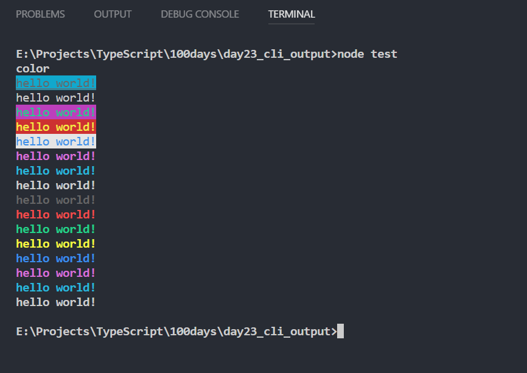

```TypeScript
import Kolor from './';

const kolor = new Kolor();

console.log(kolor.bgCyan.underline.black.text("hello world!"));
console.log(kolor.reset.bgBlue.red.text("hello world!"));
console.log(kolor.bold.bgMagenta.green.text("hello world!"));
console.log(kolor.italic.bgRed.yellow.text("hello world!"));
console.log(kolor.dim.bgWhite.blue.text("hello world!"));
console.log(kolor.magenta.text("hello world!"));
console.log(kolor.cyan.text("hello world!"));
console.log(kolor.white.text("hello world!"));
console.log(kolor.gray.text("hello world!"));
console.log(kolor.redBright.text("hello world!"));
console.log(kolor.greenBright.text("hello world!"));
console.log(kolor.yellowBright.text("hello world!"));
console.log(kolor.blueBright.text("hello world!"));
console.log(kolor.magentaBright.text("hello world!"));
console.log(kolor.cyanBright.text("hello world!"));
console.log(kolor.whiteBright.text("hello world!"));

```

